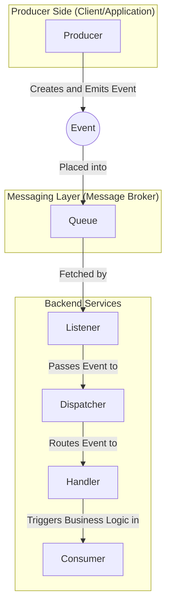

# EZQ Library

## Overview

EZQ is a powerful and easy-to-use Python library designed to abstract the complexities of event processing and consumption. It leverages asynchronous programming to provide a seamless and efficient event-driven architecture. With EZQ, developers can focus on building their applications without worrying about the underlying event management details.

## Installation

### Prerequisites

- Python 3.11 or higher
- PostgreSQL with PGMQ extension (see [pgmq](https://github.com/tembo-io/pgmq))

### Steps

TODO

## Usage

### Quick Start

EZQ simplifies event processing with minimal setup. Here's a quick example to get you started:

```python
import asyncio
from ezq import EZQEvent as Event, on_event, process_events, consumer
from dataclasses import dataclass

@dataclass
class MyEvent(Event):
    data: str

@on_event
async def handle_my_event(event: MyEvent):
    print("Handling event:", event.data)

async def main():
    await process_events([MyEvent(data="Hello, EZQ!")])
    await asyncio.gather(consumer())

if __name__ == "__main__":
    asyncio.run(main())
```

### Key Features

TODO

## Key Concepts



### Producer

A producer is a component that creates and/or emits events into the system.

A producer captures user actions, system changes, or other triggers, and generates events that initiate the event flow throughout the system. The producer is in charge of ensuring that the event is properly serialized and sent to the event system.

### Event

An event is a message that signifies a change or action within a system.

An event represents a significant occurrence or change in state within a system. In event-driven architectures, events are the primary units of communication, triggering actions or processes. They can range from user actions, like clicking a button, to system-generated events, such as a file upload or timer expiration, or even more internal things like a database change.

### Queue

A queue is a data structure used to temporarily store events until they are processed.

A queue is crucial for managing the flow of events, providing reliability and scalability by decoupling event production from consumption. Events are typically processed in a first-in, first-out (FIFO) order.

The queue is to differenciate from the event system. The event system is the core of the library and is responsible for the event flow. The queue is the storage system for the events.

### Dispatcher

A dispatcher is the component that routes events to the appropriate handlers.

A dispatcher acts as the central hub in an event-driven system, responsible for routing events to the appropriate handlers. It receives events and determines which handlers should be invoked, ensuring that each event is processed by the correct component.

### Handler

A handler is a function or method designed to process specific types of events.

A handler contains the logic required to respond to an event, such as updating a database, sending a notification, or triggering another process. Handlers enable the system to dynamically react to different events.

### Listener

A listener is a component that waits for events to occur and initiates their processing.

A listener detects events and passes them to the appropriate handlers for processing, acting as the first point of contact in the event processing pipeline.

### Consumer

A consumer is a component that executes the business logic associated with events.

A consumer listens for and processes events. It subscribes to a queue or topic and performs actions based on the events it receives.

## Learn more

### Asynchronous Programming

EZQ leverages Python's `asyncio` library to perform non-blocking I/O operations, enabling concurrent event processing without the need for complex threading models or difficult to manage async implementations.

To use the full power of EZQ, you should use async functions and asynchronous I/O operation through `asyncio` based implementations (e.g. [`aiohttp`](https://github.com/aio-libs/aiohttp), [`aiopg`](https://github.com/aio-libs/aiopg/), etc...)

EZQ is totally thread-safe and ensure that an event will always be processed **once and only once**.

### Queue System

EZQ implements [pgmq](https://github.com/tembo-io/pgmq) under the hood to manage event flow.

## License

This project is licensed under the MIT License.
